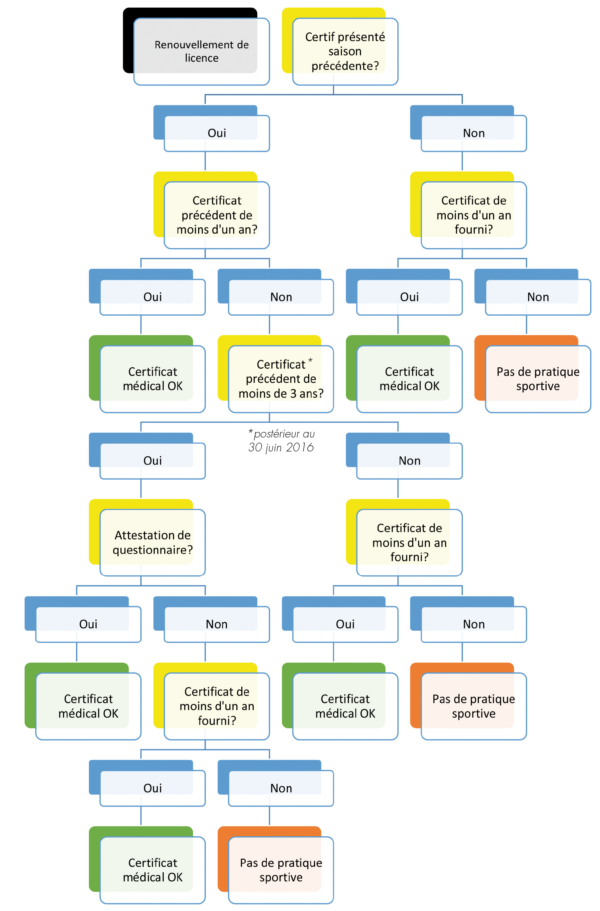

 

Cette page est un espace de partage de divers documents :
- Documents annuels d'inscription - vierges
   - demandes de licence
   - attestations médicales
- CR des assemblées générales,
- Attestations de licence
- autres

---

# ***Faire sa demande de licence***

- [demandes de licence](9_documents/2020_2021 LICENCE.pdf)
- [Modèle de certificat médical](9_documents/certificat-pour-pratique-tennis-de-table-2017-2018-1845.pdf)
- [Auto-questionnaire de santé](9_documents/auto-questionnaire-de-sante-2017-2018-1846.pdf)

Vous ne savez pas si vous devez présenter un **certificat médical** ou un **auto-questionnaire de santé** ? Essayez de suivre ce schéma : si vous comprenez quelque-chose... bah, félicitations !
Sinon, posez la question à un type (ou une fille) du club

(schéma récupéré sur le site de la **FFTT**)

[La preuve (et pour + d'informations)](http://www.fftt.com/site/actualites/2017-06-21/licence-et-certification-medicale)

---

# ***Télécharger son attestation de licence***

**Cliquez sur la flèche pour sélectionner et télécharger votre attestation de licence**

- **Saison 2020-2021**
  - [Mesroua Jean-Louis](9_documents/licences 2021/licence_8014706 mesroua jean louis.pdf)
  - [Octor Guylain](9_documents/licences 2021/licence_8016084 octor guylain.pdf)

---

# ***PV & comptes-rendus divers***

## 2021  

**Cliquez sur la flèche pour accéder aux différents documents**

- [CR Assemblée Générale](https://hackmd.io/@cedTas-Perso/SJVD-QcHP)
- [Procès Verbal Renouvellement bureau](9_documents/BeauvalTT - PV Renouvellement bureau.html)

