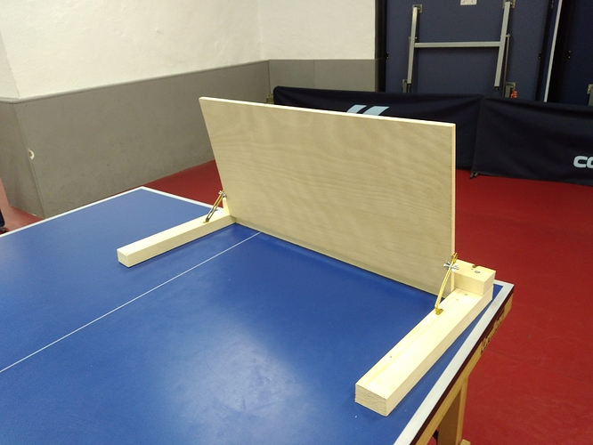

 

---

##  **re-re-suspension d'entrainement des jeunes** 

jeudi 14 janvier, le gouvernement a décidé la suspension des activités sportives en intérieur dans le cadre scolaire et extrascolaire et ce "jusqu'à nouvel ordre".
Par conséquent, les entrainements des jeunes sont, de nouveau, suspendus.  

Il ne nous reste plus qu'à jouer solo et fabriquer chacun son "return board" pour ne pas perdre la main 😉

 **Bon courage à tous !** 
 

---

##  **Meilleurs voeux 2021** 

Les joueurs, joueuses et membres du Beauvalois TT vous présentent tous leurs vœux de bonheurs, réussites et santé pour cette nouvelle année.  
En espérant que 2021 nous permettent de nous retrouver et de taper la balle ensemble.  

🏓 **Beauvalois TT** 🏓

---

