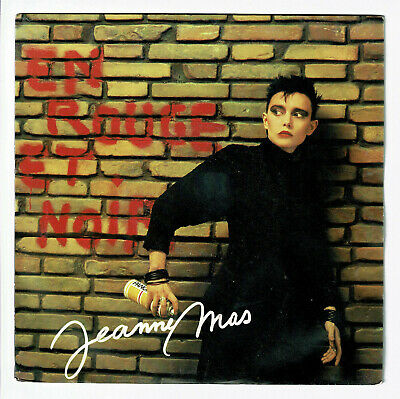
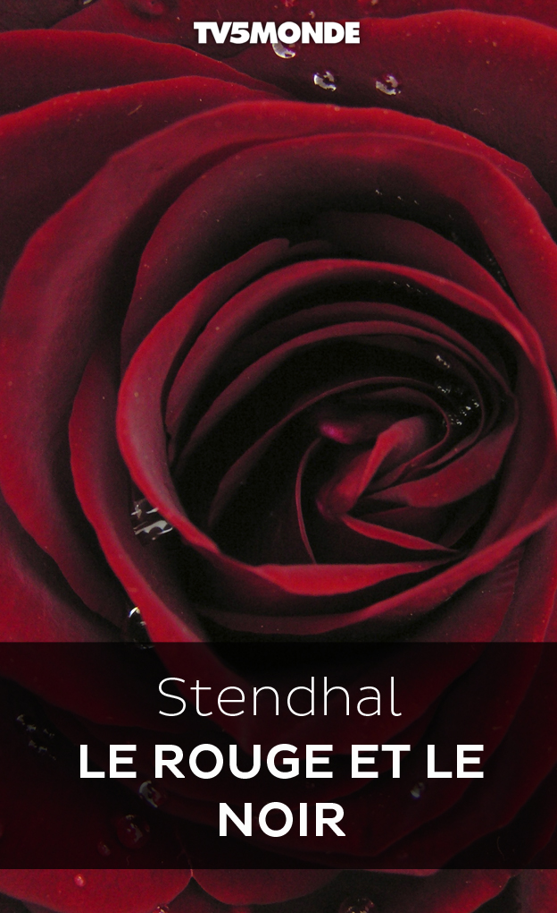
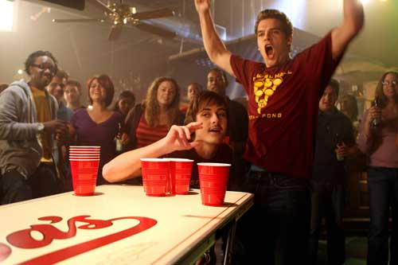

 

Le 🏓 **Beauvalois tennis de Table** 🏓 est un club de pratique de Tennis de Table  
- en compétition ou loisirs,  
- pour les enfants, juniors, seniors...  

# **Nos couleurs**

Le  **Rouge**  et le Le  **Noir**  sont nos couleurs : nous les portons fièrement lors de nos déplacement, partout en France... (mais surtout dans la Somme).  
En France, elles ont inspiré d'autres clubs, comme le **Stade Toulousain**, mais aussi de nombreux artistes : **Jeanne Mas** nous a écrit une chanson et **Stendhal** écrit un livre en l'honneur de nos couleurs.

|un club de rugby (d'une  ville rose  )|une chanson (artiste d'il y a longtemps)|un livre (qu'on a tous fait semblant de lire au lycée)|
|:---:|:---:|:---:|
||||

---

# **Pour plus d'informations et nous contacter**

 

- [**Notre page Facebook**](https://www.facebook.com/beauvaltennisdetable)
- Par mail : <beauvaloistt@neuf.fr>... euuuuh oui, on a bien dit @neuf 😏.  
- Le gymnase, aux dates et horaires d'entraînements  
- Les signaux de fumée mais on n'est pas certain de répondre rapidement 😏.  

---

# **Composition du bureau**

 

Lors de la 1ère assemblée générale de l'année, nous avons procédé au renouvellement du bureau :  

- **Président :** Geoffrey Masson  
- **Trésoier :** Fabrice Valour  
- **Secrétaire :** Cédric Tassart (c'est aussi le type auprès de qui il faut se plaindre s'il y a des fotes d'ortografe sur le site)  

Ces membres ont été élus selon leur classement au **Beer-Pong**... évidemment ! 

 **Sympa les copains !** 
