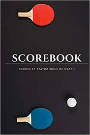

 

Le **Beauvalois tennis de Table** est un club de pratique de Tennis de Table  
- en compétition ou loisirs,  
- pour les enfants, juniors, seniors...  

---

##  **Tarifs** 

- Juniors, Séniors , Vétérans (15 ans et +)
  - 40 € la licence promotionnelle (entrainements)
  - 70 € la licence traditionnelle (compétitions)

- Minimes & Cadets (11 à 14 ans)
  - 35 € la licence promotionnelle
  - 50 € la licence traditionnelle

- Poussins & Benjamins (8 à 10 ans)
  - 35 € la licence promotionnelle
  - 40 € la licence traditionnelle

La troisième licence prise dans la même famille sera à moitié prix !

---

##  **Entrainements & rencontres** 
- Entrainements  
  - lundi : 
       - à compter de 18h00 pour les adultes et adolescent·e·s.  
  - mercredi :  
     - de 16h45 à 17h45 pour les jeunes,  
     - à compter de 18h00 pour les adultes et adolescent·e·s.  
- Rencontres : 
  - Vendredi, pour les équipes 2 et 3,
  - Dimanche, pour l'équipe 1

---

##  **Profil de nos équipes** 

Pour mesurer les performances des joueurs ET des équipes lors des différentes journées de championnat, on doit prendre différents paramètres en considération :
- la force du joueur **ET**
- la force d’une équipe.  

Lors de nos différentes publications, on fera référence aux points individuels (des joueurs) et aux points cumulés correspondant à la somme des points des 4 joueurs de l’équipe.

**Pour rappel, les points individuels**  

Un joueur ou une joueuse commençant le tennis de table démarre avec 500 points sur sa licence. Il ou elle est donc « classé(e) 5 ».  
Chaque partie remportée rapporte entre **0** et **40** points qu'il faut pondérer par un coefficient en fonction du type de compétition ;  
chaque partie perdue coûte entre 0 et 29 points selon la différence de points avec l'adversaire (suivant le coefficient de la compétition cela peut être plus).  
- Une victoire sur un joueur mieux classé est appelé une performance ou une « perf » dans le langage courant.
- Une défaite contre un joueur moins bien classé est appelée une contre-performance ou plus simplement une « contre ».

A Beauval, on a **17 joueurs** inscrits en compétition :  
- 8 « joueurs classés 5 »,  
- 1 « classé 6 »,  
- 1 « classé « 7 »,  
- 2 « classés 8 »,  
- 4 « classés 9 »  
- 1 « classé 11 ».

**Les points de l’équipe**  

Notre club a **3 équipes** en compétition.  
Chaque week-end, on procède à un turn-over pour que tout le monde puisse jouer. Par exemple, lors de la journée de championnat du 19 octobre, le cumul de points des équipes Beauvaloises est le suivant :  

- Equipe 1 – 3636 points,
- Equipe 2 – 3072 points,
- Equipe 3 – 2078 points.

---
