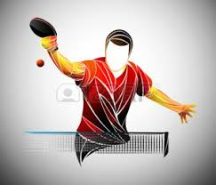

 

# **2021 - Phase 1**

## ***Phase 1 - Journée 3***

Ce week-end, le **Beauval Tennis de Table** a enregistré **2 victoires** et **1 défaite**.

Vendredi, **l’équipe 2** rencontrait Puzeaux.
Une rencontre qui s’annonçait équilibrée même si, au cumul des points, notre équipe avait un léger avantage : + 252 pts. Au final, Beauval gagne 14-4 avec 4 victoires de Geoffrey et  Eric, 3 victoires de Cédric et 1 belle victoire d’Hugo (1 perf) + les 2 doubles.

Dans le même temps, face à St-Sauflieu, **l’équipe 3** s’attendait à une soirée difficile face à un adversaire sensiblement supérieur : déficit de - 160 pts pour Beauval. Effectivement, notre équipe s’incline 16-2.

Dimanche, **l’équipe 1** n’était pas favorite face à Rue : déficit de – 547. Mais, c’était sans compter sans un Thomas des grands soirs (ou plutôt des grands matins) et des partenaires coriaces. C’est bien notre équipe qui remporte la rencontre 10-8 avec « 2 perfs » de Pascal et de Thomas.

---

